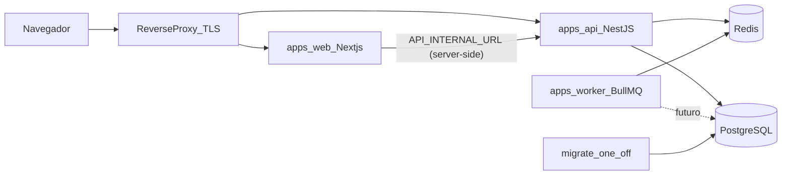

# Arquitetura — visão geral (Foundation)

## Componentes

- **web** chama a API apenas no servidor; a URL interna nunca vai ao browser.
- **api** expõe REST. Rotas de negócio sob `/api/v1`; `/health/live`, `/health/ready`, `/docs`
  e `/openapi.json` ficam fora do prefixo.
- **worker** consome filas BullMQ. Registro único de handlers em `apps/worker/src/processors.ts`.
- **migrate** aplica `prisma migrate deploy` antes de api/worker subirem.

## Fronteiras transversais já implementadas

| Preocupação         | Onde                                                                                    |
| ------------------- | --------------------------------------------------------------------------------------- |
| Configuração        | `packages/config` — zod, fail-fast no startup, sem ecoar valores                        |
| Logs estruturados   | `packages/logger` (pino JSON, redaction) + `nestjs-pino`                                |
| request/correlation | `apps/api/src/common/request-context.middleware.ts`                                     |
| Erros               | `DomainError` + `AllExceptionsFilter` → `{ error: { code, message, request_id } }`      |
| Validação           | `ZodValidationPipe` na borda HTTP                                                       |
| Healthchecks        | `apps/api/src/health` (DB `SELECT 1`, Redis `PING`, timeout)                            |
| OpenAPI             | `@nestjs/swagger`; desligado por padrão em `production`                                 |
| Jobs                | `DEFAULT_JOB_OPTIONS` (3 tentativas, backoff exponencial), `jobId` como idempotency key |

## Propagação de correlação

`x-request-id` identifica o hop HTTP; `x-correlation-id` acompanha o fluxo inteiro. Ambos são
devolvidos no response, gravados em toda linha de log da requisição e devem ser copiados para
`JobEnvelope.correlation_id` ao enfileirar jobs (contrato em `packages/contracts`).

## Módulos

Base preparada (vazia) em `apps/api/src/modules`: `iam`, `organizations`, `users`, `audit`,
`system-admin`. Layout interno e regras: `apps/api/src/modules/README.md`.

## Decisões

Ver `docs/adr/` (ADR-001 a ADR-008).
